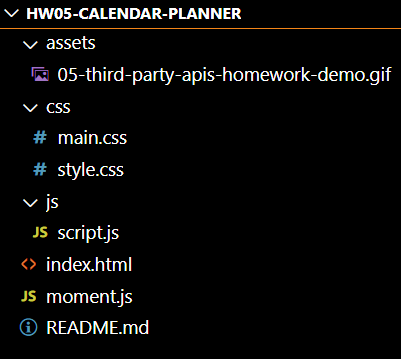

# GT-Coding Bootcamp -- 05 Third-Party APIs: Work Day Scheduler

## 1. Overview:

This is a calendar application that allows a user to save events for each hour of the day. This app will run in the browser and feature dynamically updated HTML and CSS powered by jQuery.

## 2. Directory Structure

## 3. Mock-Up

The following image shows the web application's appearance and functionality:

## 4. Links to deployed application

[Click here to go to github repository.](https://github.com/willielibet/workday-calendar-html-css-js-jquery.git)

[Click here to go to deployed application.](https://willielibet.github.io/workday-calendar-html-css-js-jquery/)

## 5. Resources 

[Resource A](https://www.codegrepper.com/code-examples/javascript/add+hours+and+minutes+moment+js)
[Resource B](https://www.w3schools.com/icons/tryit.asp?filename=tryicons_fa-save )

[Resource C](https://getbootstrap.com/docs/4.0/components/input-group/)
[Resource D](https://kit.fontawesome.com/55f2eac7a6.js)
[Resource E](https://my.own.mind)