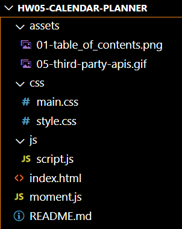

# GT-Coding Bootcamp -- 05 Third-Party APIs: Work Day Scheduler

https://www.codegrepper.com/code-examples/javascript/add+hours+and+minutes+moment+js
https://www.w3schools.com/icons/tryit.asp?filename=tryicons_fa-save 
https://getbootstrap.com/docs/4.0/components/input-group/
https://kit.fontawesome.com/55f2eac7a6.js

## Table of Contents

1. Overview
2. Directory Structure
3. Mock-Up
4. Links to deployed application
5. Resources 

## 1. Overview:
This is a calendar application that allows a user to save events for each hour of the day. This app will run in the browser and feature dynamically updated HTML and CSS powered by jQuery.


## 2. Directory Structure



## 3. Mock-Up

The following image shows the web application's appearance and functionality:


## 4. Links to deployed application
[Click here to go to github repository.](https://github.com/willielibet/gt-bootcamp-quiz-app-js-html-css.git)

[Click here to go to deployed application.](https://willielibet.github.io/gt-bootcamp-quiz-app-js-html-css/)

## Acceptance Criteria

```md
GIVEN I am using a daily planner to create a schedule
WHEN I open the planner
THEN the current day is displayed at the top of the calendar
WHEN I scroll down
THEN I am presented with timeblocks for standard business hours
WHEN I view the timeblocks for that day
THEN each timeblock is color coded to indicate whether it is in the past, present, or future
WHEN I click into a timeblock
THEN I can enter an event
WHEN I click the save button for that timeblock
THEN the text for that event is saved in local storage
WHEN I refresh the page
THEN the saved events persist
```

The following animation demonstrates the application functionality:


## Grading Requirements

This homework is graded based on the following criteria: 

### Technical Acceptance Criteria: 40%

* Satisfies all of the above acceptance criteria plus the following:

  * Uses a date utility library to work with date and time

### Deployment: 32%

* Application deployed at live URL

* Application loads with no errors

* Application GitHub URL submitted

* GitHub repo contains application code

### Application Quality: 15%

* Application user experience is intuitive and easy to navigate

* Application user interface style is clean and polished

* Application resembles the mock-up functionality provided in the homework instructions

### Repository Quality: 13%

* Repository has a unique name

* Repository follows best practices for file structure and naming conventions

* Repository follows best practices for class/id naming conventions, indentation, quality comments, etc.

* Repository contains multiple descriptive commit messages

* Repository contains quality README file with description, screenshot, and link to deployed application

## Review

You are required to submit the following for review:

* The URL of the deployed application

* The URL of the GitHub repository, with a unique name and a README describing the project

- - -
© 2021 Trilogy Education Services, LLC, a 2U, Inc. brand. Confidential and Proprietary. All Rights Reserved.
